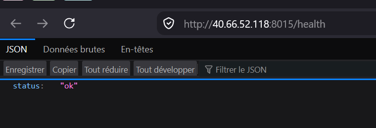
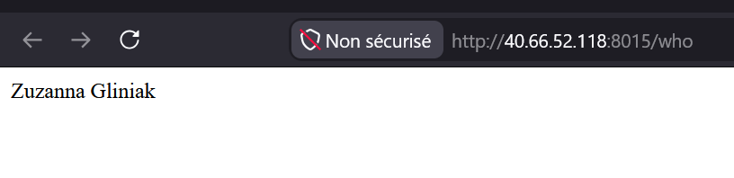

# ClientHub – CI/CD avec GitHub Actions, Docker Hub et VM Azure

Application interne ClientHub : une API Flask (`api/`), une base MySQL et une page web Nginx (`site/`), orchestrées avec Docker Compose.

## Lancer le projet en local

```bash
docker compose up -d
```

- Page web : http://localhost:8080
- API : http://localhost:5000/health

| Endpoint | Description |
|---|---|
| `GET /health` | Vérification de l'état : `{"status": "ok"}` |
| `GET /who` | Prénom et nom de l'auteur |
| `GET /clients` | Liste des clients lue dans MySQL |
| `POST /clients` | Ajoute un client (`{"name": "..."}`) |

## Déclenchement du déploiement

Chaque `git push` sur la branche `main` déclenche automatiquement le workflow `.github/workflows/ci.yml`. Aucune action manuelle n'est nécessaire après le push.

## Fonctionnement du pipeline

```
push main → unit-tests ┐
          → e2e-tests  ┴→ build-push → deploy (+ vérification)
```

1. **unit-tests** : installe les dépendances et lance `pytest` sur `api/test_app.py` (tests du code Flask, sans base).
2. **e2e-tests** : démarre toute l'application avec `docker compose up -d --build`, puis lance `pytest e2e`. Les tests envoient de vraies requêtes HTTP : disponibilité (`/health`), `/who`, lecture des clients initialisés par `init.sql`, et un parcours complet ajout puis lecture d'un client.
3. **build-push** : uniquement si les jobs 1 et 2 réussissent. Construit l'image, la teste rapidement sur `/health`, puis la pousse sur Docker Hub avec deux tags : `latest` et le SHA du commit.
4. **deploy** : se connecte en SSH à la VM Azure, récupère l'image du commit depuis Docker Hub, remplace le conteneur et vérifie que l'application répond sur `http://<IP de la VM>:8015/health`.

Si un test échoue, le pipeline s'arrête : l'image n'est ni publiée ni déployée.

## Application déployée sur la VM Azure

Accessible sur l'IP publique : http://40.66.52.118:8015/health





## Choix techniques

- **Tests** : `pytest` pour les tests unitaires (client de test Flask) et pour les tests E2E (`requests`), donc un seul outil et une seule commande par type de test.
- **Tags de l'image** : `latest` pour la dernière version, SHA du commit pour savoir exactement quel code tourne et pouvoir revenir à une version précise. La VM déploie le tag SHA.
- **Déploiement idempotent** : le conteneur a un nom fixe (`gliniak_zuzanna`). Le déploiement supprime l'ancien conteneur (`docker rm -f`) puis le relance : relancer le workflow ne crée jamais de doublon. `--restart unless-stopped` relance l'application si la VM redémarre.
- **VM partagée** : port attribué `8015` côté VM (`-p 8015:5000`), nom de conteneur personnel pour ne pas toucher aux applications des autres élèves.
- **Connexion SSH** : action `appleboy/ssh-action` avec utilisateur et mot de passe, selon les indications de l'enseignant.
- **Sur la VM, l'API tourne seule** (sans MySQL) : `/health` et `/who` fonctionnent, et `/clients` renvoie une erreur claire `503` au lieu de planter.
- **Sécurité** : aucun identifiant dans le dépôt, tout passe par les GitHub Secrets :

| Secret | Contenu |
|---|---|
| `DOCKERHUB_USERNAME` / `DOCKERHUB_TOKEN` | Identifiants Docker Hub (jeton d'accès) |
| `VM_HOST` / `VM_USER` / `VM_PASSWORD` | Accès SSH à la VM |
